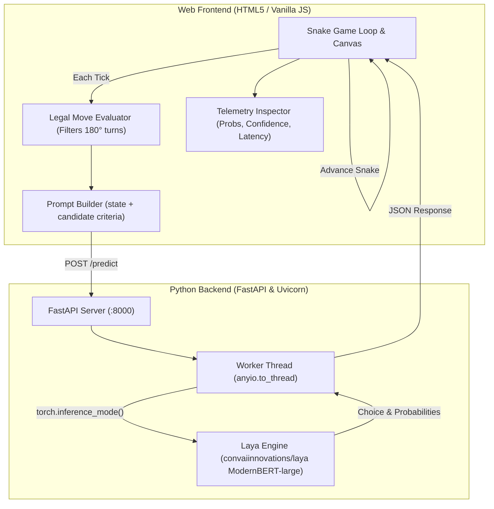

# 🐍 AI-Powered Snake Game with Laya Decision Engine

An interactive, retro-futuristic Snake game where **AI plays the game autonomously** using the [Laya](https://huggingface.co/convaiinnovations/laya) Language Model (`convaiinnovations/laya`, ModernBERT-large).

The project brings together a high-performance **FastAPI backend** running local LLM inference and a responsive **HTML5 Canvas / Vanilla JavaScript game frontend** featuring a live AI telemetry dashboard.

---

## 🎮 Features

- **🤖 AI Autopilot (Laya LLM)**: The snake autonomously decides every move using real-time decision inference powered by Laya.
- **📊 Real-Time AI Telemetry Dashboard**:
  - Live candidate move probability distribution bar charts
  - Model confidence score & inference latency (ms) counter
  - Inspect prompt payloads & semantic criteria sent to the LLM in real-time
- **🛡️ Built-in Collision Guardrails**: If the model suggests a fatal collision while safe paths exist, safety heuristics guide the snake to survive.
- **🎮 Manual & Dual-Mode Controls**: Switch seamlessly between human control (Arrow keys / WASD) and AI Autopilot at any millisecond with hotkey `M`.
- **⚡ Low-Latency Inference Pipeline**:
  - Preloads ModernBERT-large (421M params) into memory on server startup
  - Pinned CPU inter-op threading (`torch.set_num_interop_threads(1)`) to eliminate multi-core lock contention
  - Automated startup warmup pass to prevent first-turn latency lag
- **🌐 Fullstack Single-Server Architecture**: FastAPI directly serves the web game at `http://localhost:8000/`, with zero complex build tools or bundlers needed.

---

## 🏗️ Architecture



---

## 📁 Repository Structure

```
ai-powered-snake-game/
├── index.html               # Main game interface and live AI telemetry dashboard
├── style.css                # Retro arcade dark theme and responsive UI styling
├── js/                      # Modular client-side game engine
│   ├── ai.js                # Laya model integration, candidate move evaluation, & guardrails
│   ├── audio.js             # Web Audio API sound effect generator
│   ├── constants.js         # Configuration, adaptive API endpoint, and game state
│   ├── game.js              # Game loop, tick scheduling, and food spawning
│   ├── input.js             # Keyboard (WASD, Arrows, Space, M) and button listeners
│   ├── renderer.js          # Canvas rendering for snake, food, and candidate overlays
│   └── storage.js           # LocalStorage high score manager
├── main.py                  # FastAPI server: model preloading, warmup, /predict, and static host
├── test_api.py              # Automated test suite (FastAPI endpoints & Snake AI decision test)
├── pyproject.toml           # Project metadata and dependencies (uv managed)
├── uv.lock                  # Pinned uv lockfile
├── requirements.txt         # Standard pip fallback requirements
├── .gitignore               # Git ignore rules for Python, caches, and system files
└── README.md                # Documentation and guide
```

---

## 🚀 Quickstart

### Prerequisites
- Python 3.10+ (Python 3.12+ or 3.14 recommended)
- Either [uv](https://docs.astral.sh/uv/) (recommended for fastest setup) or standard `pip`

---

### Option 1: Quickstart with `uv` (Recommended)

1. **Install dependencies**:
   ```bash
   uv sync
   ```

2. **Start the server**:
   ```bash
   uv run python main.py
   ```

3. **Open the game**:
   Navigate to [http://localhost:8000](http://localhost:8000) in your web browser.

---

### Option 2: Quickstart with `pip`

1. **Create and activate a virtual environment**:
   ```bash
   python -m venv .venv
   # Windows:
   .venv\Scripts\activate
   # macOS/Linux:
   source .venv/bin/activate
   ```

2. **Install dependencies**:
   ```bash
   pip install -r requirements.txt
   ```

3. **Start the server**:
   ```bash
   python main.py
   ```

4. **Open the game**:
   Open [http://localhost:8000](http://localhost:8000) in your browser.

> [!TIP]
> You can also double-click `index.html` to open the game directly via `file:///`. It will automatically communicate with the local server at `http://127.0.0.1:8000/predict`.

---

## ⌨️ Game Controls

| Key / Control | Action |
|:---:|:---|
| **`M`** | **Toggle Laya AI Autopilot ON / OFF** |
| **`Arrow Keys` / `WASD`** | Steer snake manually |
| **`Space`** | Start game / Pause / Resume |
| **`+` / `-`** | Adjust manual game speed |
| **📊 Icon** | Toggle live AI Decision Telemetry panel |

---

## 📡 API Reference

Interactive Swagger documentation is available at [http://localhost:8000/docs](http://localhost:8000/docs).

### 1. `GET /`
Serves the playable Snake game HTML application.

### 2. `GET /health`
Returns model readiness and memory status:
```json
{
  "status": "ok",
  "model_loaded": true,
  "model": "convaiinnovations/laya"
}
```

### 3. `POST /predict`
Executes classification and decision inference on the game state:
```json
{
  "state": {
    "current_position": "Snake head is at position x=10, y=10",
    "previous_direction": "UP",
    "food_direction": "Food is located 5 steps UP and 2 steps RIGHT",
    "canvas_bounds": "Grid size is 20 columns by 20 rows"
  },
  "questions": {
    "next_move": {
      "type": "choice",
      "instructions": "Which move should the snake take to safely reach the food?",
      "criteria": {
        "UP": "BEST MOVE: Clear safe path moving directly closer towards target food",
        "LEFT": "NEUTRAL MOVE: Clear safe path maintaining distance from target food",
        "RIGHT": "SUBOPTIMAL MOVE: Clear safe path moving further away from target food"
      }
    }
  }
}
```

---

## 🧪 Testing

Run the integration and AI decision test suite:

```bash
# With uv:
uv run python test_api.py

# With pip:
python test_api.py
```

---

## 📤 Pushing to GitHub

To push this project to a new repository on GitHub:

1. **Create a new empty repository on GitHub** (e.g. `ai-powered-snake-game`). Do not initialize with a README, .gitignore, or license.

2. **Run the following commands in this directory**:
   ```bash
   cd D:\ai-powered-snake-game

   # Initialize git repository (if not already initialized)
   git init -b main

   # Stage all files
   git add .

   # Commit
   git commit -m "Initial commit: AI-powered Snake game with Laya LLM decision engine"

   # Add your GitHub remote URL
   git remote add origin https://github.com/<YOUR-USERNAME>/<YOUR-REPO-NAME>.git

   # Push to GitHub
   git push -u origin main
   ```

---

## 📜 License

MIT License. Feel free to use and modify for personal or commercial projects.
